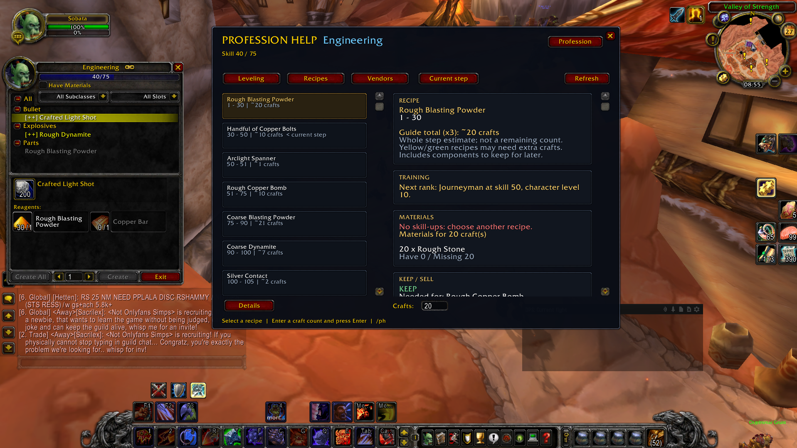
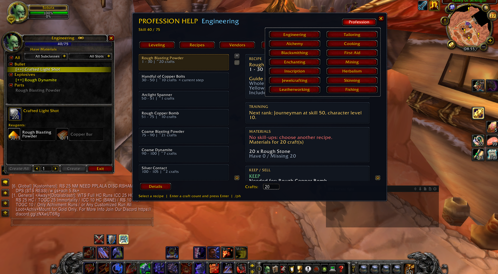
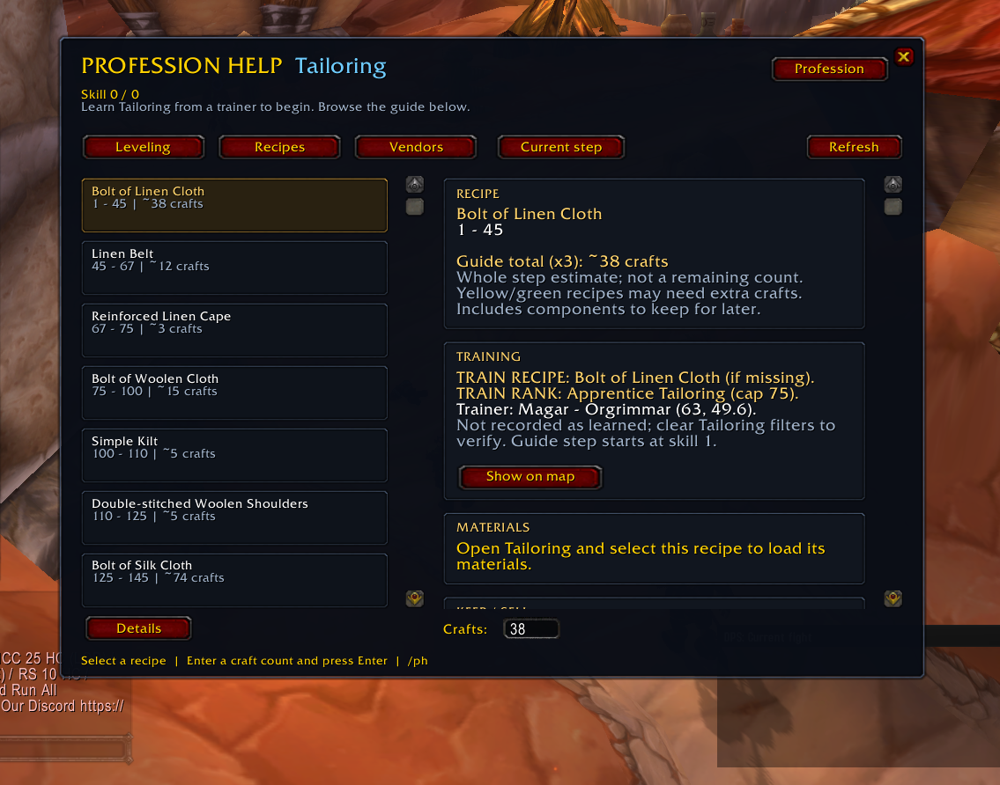

# Profession Help

### Know what to craft. Know what to keep. Find your trainer.

A profession companion for **World of Warcraft 3.3.5a**, built around leveling on **Warmane Icecrown**. Follow your next step without constantly switching between the game and a guide.

## Your profession, one step at a time

| Question | Profession Help shows you |
| --- | --- |
| What should I craft? | A leveling route from 1 to 450 and the current skill range. |
| How many crafts? | Whole-step estimates tuned for **x3 profession skill gains**, with reserves for later components. |
| What materials do I need? | Reagents from your learned recipes, quantities in your bags and what is missing. |
| Should I keep this? | KEEP / USE / SELL guidance for route components and finished items. |
| Do I need training? | Recipe and rank reminders, with **Show on map inside TRAINING** for catalogued trainers. |
| What does it cost? | Auctionator prices when available and vendor purchase prices recorded during visits. |

## All 14 professions

**Crafting:** Engineering, Alchemy, Blacksmithing, Enchanting, Inscription, Jewelcrafting, Leatherworking and Tailoring.

**Gathering:** Mining, Herbalism and Skinning.

**Secondary:** Cooking, First Aid and Fishing.

Use **Profession** to switch guides. Gathering guides suggest areas and activities; their map button opens the zone rather than claiming exact resource spawns.

## Training, without hunting through menus

Missing a recipe or reaching your skill cap? Check the TRAINING card. For supported trainers, click **Show on map** right there. Catalogued NPC pins do not require explored terrain or the necessary reputation.

## Install in a minute

1. Download **ProfessionHelp-0.3.1-alpha.zip** from [Releases](https://github.com/sobata1995-source/ProfessionHelp/releases/tag/v0.3.1-alpha). Choose the addon ZIP, not GitHub's automatically generated source archive.
2. Close WoW completely.
3. Extract the **ProfessionHelp** folder into `World of Warcraft/Interface/AddOns/`.
4. Check that the path ends in `Interface/AddOns/ProfessionHelp/ProfessionHelp.toc`.
5. Start WoW and enable **Profession Help** in the character-selection AddOns menu.

Updating? Replace the previous addon folder. Keep your SavedVariables to retain recorded recipes and prices.

## Open it when you need it

- Click the **minimap button** or type `/ph` for manual access.
- Opening your own crafting profession automatically selects its guide below skill 450.
- It stays closed when you log in. At **450**, automatic opening stops; manual access still works.
- Use the selector for Herbalism, Skinning and Fishing. Mining also recognizes **Smelting**.
- **Refresh** updates the display and returns Leveling to your current step. Open the profession window to rescan recipes.

| Command | Action |
| --- | --- |
| `/ph` | Open the helper |
| `/ph tailoring` | Open a named profession |
| `/ph auto` | Toggle automatic opening |
| `/ph pins` | Toggle general map pins |
| `/ph reset` | Center the window |

## Preview

[Browse all six gameplay screenshots](media/README.md), including Engineering and Tailoring at 450 and the Fishing guide.

[Watch or download the short gameplay preview](https://github.com/sobata1995-source/ProfessionHelp/releases/download/v0.3.1-alpha/profession-preview.mp4).

The screenshots and preview demonstrate the interface; earlier captures may not show the latest Refresh feedback.

## Before you start

- **Alpha release:** built for the original **3.3.5a English client (Interface 30300)**. Retail and modern Classic clients are not supported by this release.
- **x3 estimates:** craft counts cover the whole step, not the remaining crafts from your exact skill. Yellow/green recipes can require extra attempts. Keep quantities can exceed the crafts needed just for skill. Cooking counts are approximate.
- **Learned recipe data:** open your profession, clear filters and expand categories to load reagents. Unscanned recipes do not have invented material lists.
- **A growing catalogue:** all professions have leveling routes, but this is not a complete database of every recipe, trainer or vendor. A Dalaran trainer is used where no local trainer is catalogued.
- **Prices need data:** Auctionator integration is optional. Unknown prices remain unknown; Refresh does not run a new auction scan. Recorded prices may be out of date.
- **You stay in control:** the addon does not craft, purchase, sell or discard items for you.

Lua 5.1 checks cover guide rendering, recipe isolation, saved-data migration, map behavior and Refresh. Full in-game testing across all professions is still ongoing. Warmane behavior may differ from guide sources.

## Found something wrong?

[Open an issue](https://github.com/sobata1995-source/ProfessionHelp/issues) with your addon version, profession, current skill, realm, recipe name and steps to reproduce. A screenshot or Lua error helps. Please remove account details from any logs you share.

## Support development

Profession Help is free to use. If it saves you time and you would like to support updates, you can leave an optional tip:

Feedback and testing are welcome too.

## Guide references

Routes are adapted from [Wowhead WotLK profession guides](https://www.wowhead.com/wotlk/guides/professions). Cooking uses [Icy Veins](https://www.icy-veins.com/wotlk-classic/cooking-profession-and-leveling-1-450-guide); First Aid uses [WoW-professions](https://www.wow-professions.com/wotlk/first-aid-leveling-guide-wotlk-classic). Individual guide links are available in the addon. Profession Help is an independent community project, not an official Warmane or Wowhead product.
